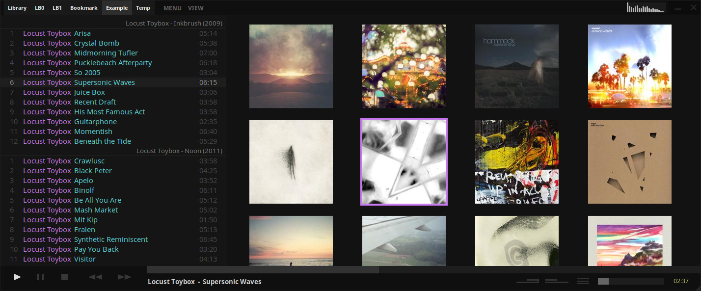

# Tauon Music Box

A desktop music player for playback of local audio files.
Designed to be simple and streamlined while putting the user in control of their music library.

### Features :sparkles:

  - Plays most common codecs including MP3 and FLAC.
  - Simple drag and drop track importing.
  - Fast and responsive UI.
  - Playlist oriented search and sorting.
  - Visually keep track of play time.
  - Automatic CUE sheet detection.
  - Transcode folders while keeping album art. Useful for copying to DAP's.
  - Last.fm scrobbling.
  - Lyrics display with support for fetching lyrics from LyricWiki.
  - Open Icecast/Shoutcast streams from URL. Record streams with automatic tagging and splitting.
  - Outbound radio broadcasting. Streams playlist in background without affecting local playback.

### Getting Started :dizzy:

For __Windows__, download latest installer from [releases](https://github.com/Taiko2k/tauonmb/releases) section.

For __Arch Linux__, install from the AUR:  

    $ yaourt -S tauon-music-box

For __Other Linux distributions__, you can try an experiemental **flatpak** package.

1. If you have not already, make sure you have correctly installed and configured flatpak for your distro. See https://flatpak.org/setup/.
2. After downloading from lastes release in  [releases](https://github.com/Taiko2k/tauonmb/releases) section. Install using `flatpak install --user tauon.flatpak`. To uninstall run `flatpak uninstall --user org.taiko2k.tauon`

___

For further documentation see [guide](docs/guide.md).

Feel free to submit any issues or suggestions.
