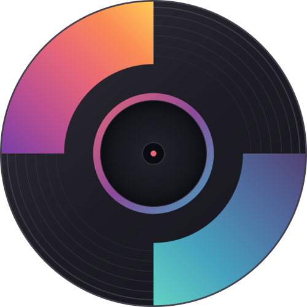

  

  <b>TAUON</b>　// A powerful and streamlined music player for the desktop.

  <a href="https://github.com/Taiko2k/Tauon/releases">Download</a> ·
  <a href="https://tauonmusicbox.rocks/manual/overview/">Manual</a> ·
  <a href="https://flathub.org/apps/com.github.taiko2k.tauonmb">Flathub</a> ·
  <a href="https://discord.gg/v4EmhES">Discord</a>

  

## Features :sparkles:

  - Fast, comfortable and responsive UI with beautiful automatic theming.
  - Support Milkdrop visualisations.
  - Support for **gapless playback**.
  - Simple **drag and drop** functionality.
  - Supports common codecs such as **.FLAC** and tracker file types such as **.MOD**.
  - Seamless support for CUE sheets.
  - Stream music from your **PLEX**, **Jellyfin** or **Airsonic** server.
  - Customisable UI with multiple widgets to choose from.
  - Shortcuts for searching artists on *Rate Your Music* and tracks on *Genius*.
  - **Extract archives** and import your music downloads in **one click**! :zap:
  - And many more!

## Download and Install :dizzy:

### macOS

For macOS DMG see the [releases](https://github.com/Taiko2k/TauonMusicBox/releases) page.

### Windows

For Windows installer see the [releases](https://github.com/Taiko2k/TauonMusicBox/releases) page.

### Linux

Installation is available on [Arch Linux](https://archlinux.org/packages/extra/x86_64/tauon-music-box/). Tauon is also available on Flathub, and portable binaries are published on the [releases](https://github.com/Taiko2k/Tauon/releases) page.

Flatpak uses sandboxing, see [here](https://github.com/Taiko2k/TauonMusicBox/wiki/Sandboxing-Quirks) for notes.

There is also a 3rd party AppImage available [here](https://github.com/domesya/Tauon-AppImage).

___

I highly recommend reading the Tauon [manual](https://tauonmusicbox.rocks/manual/overview/).

Feel free to submit any issues you encounter.

